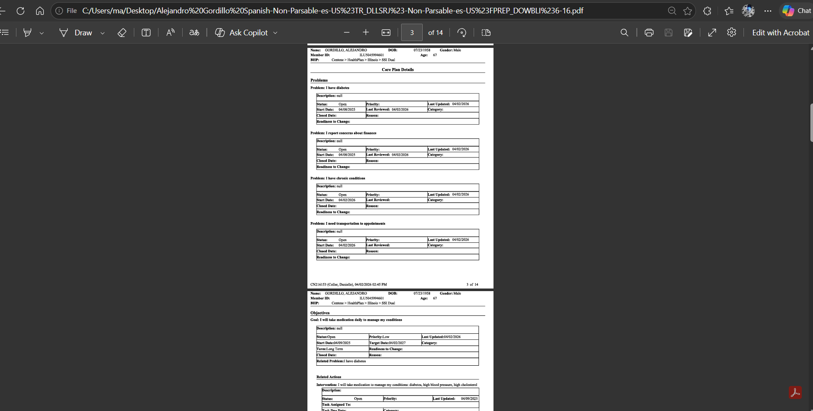

# 📄 Automated PDF-to-Word Extraction & Formatting Engine

> **🔒 Privacy Notice:**
> *The source code for this project is kept private due to Non-Disclosure Agreements (NDA) and client data privacy. This repository serves as a demonstration of the system's architecture and capabilities.*

## 🚀 Overview
A standalone desktop application engineered to automate the extraction of unstructured text and complex tabular data from heavily formatted, OCR-processed PDFs into strict, highly-formatted Word document templates. This tool acts as a complete Desktop Publishing (DTP) automation pipeline.

## ✨ Key Features
* **Hybrid Extraction Pipeline:** Utilizes targeted text/header extraction alongside regex-based OCR error correction (e.g., automatically fixing character misinterpretations like reading 'I' as '1').
* **Advanced Table Reconstruction:** Accurately reconstructs complex tables with imprecise cell boundaries, overcoming standard OCR limitations.
* **Strict Layout Integrity (DTP):** Dynamically renders extracted data into predefined Word templates while programmatically enforcing strict guidelines (exact table borders, cell margins, paragraph indentation).
* **Automated Workflow:** Features a custom Graphical User Interface (GUI) for easy batch processing and template selection.

## 🛠️ Tech Stack & Tools
* **Language:** Python
* **GUI:** CustomTkinter
* **Data Extraction:** `pdfplumber`, `pdf2docx`
* **Document Formatting:** `python-docx`, `docxtpl` (Jinja2)
* **OCR Quality Assurance:** Custom Regex algorithms

## 📸 Project Showcase

**1. Application Interface:**

**2. Original PDF Input vs. Formatted Word Output:**

---
*Built by a passionate Document Processing & Automation Specialist.*
